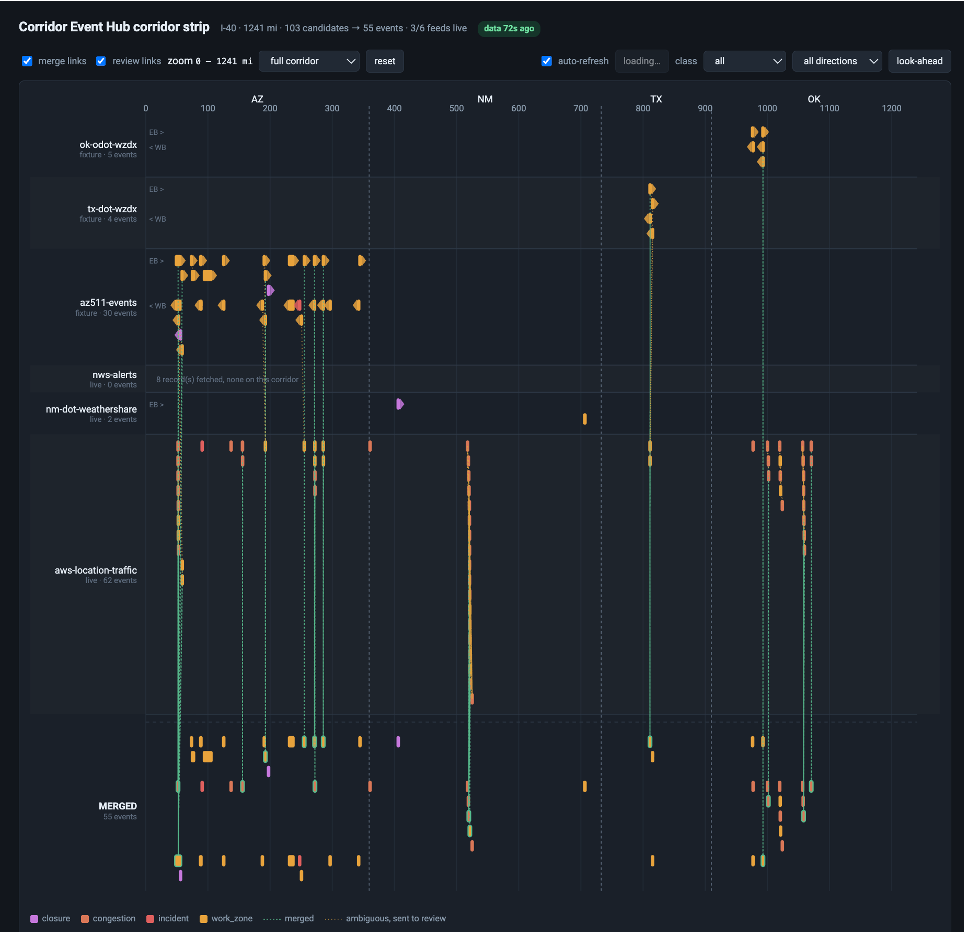

# Corridor Event Hub for ADS

A federated roadway-intelligence layer for the I-40 corridor across Arizona, New
Mexico, Texas and Oklahoma, built for the **Automated Driving System (ADS)** as its
primary consumer. Each state keeps its own 511 system; the Hub ingests
from six live feeds, normalizes onto one linear reference, reconciles duplicates
across agencies, scores confidence, runs a seven-state event lifecycle, and
republishes through a query API and a WZDx-conformant work-zone feed.

Every command below runs from `src/`, and bare paths in prose are relative to
it; markdown links are relative to this file. **Start there, not here:**
[src/README.md](src/README.md) covers `npm run setup`, the live-feed probe
that needs no AWS account, the test suites, both UIs in full, the spatial database and
what the live agency payloads actually look like. `npm run help` lists every command
grouped, and `make` twins exist for all of them.

The pipeline is a complete vertical slice: **collect → normalize → resolve →
lifecycle timers → query API + WZDx feed**. Read
[src/README.md](src/README.md) before quoting status anywhere — a green build means the
code does what it says, not that every threshold in it is right.

## Architecture


## Deploy

```bash
cd src                                           # every command below runs from here
npm install                                      # the CDK toolkit is a devDependency
npx cdk bootstrap                                # once per account/region
                                                 # create the three feed secrets here
npm run deploy -- -c alarmEmail=you@example.com  # the command to use
npm run db-migrate                               # apply the schema
npm run status                                   # confirm it, one screen
```

**Three feed credentials must exist as secrets before you deploy**, which is why they
are a step in the block above rather than a follow-up. The schedules are created
enabled, so polling starts as soon as the stack finishes. A missing credential is not
fatal — the collector reports an unresolvable secret as source health rather than
raising, so nothing reaches a dead-letter queue — but three of the six feeds stay dark
until the secret exists, and a corridor missing three states looks like a quiet corridor.
Oklahoma's
token is published in the federal WorkZone Feed Registry and needs no signup, TxDOT's
is requested from the address the feed itself publishes, Arizona's is a developer
signup at az511.gov. The `create-secret` command for each, the exact secret name every
collector resolves, and what breaks when one is missing are in
[src/docs/OPERATING.md § Secrets](src/docs/OPERATING.md#secrets) — which also
covers migrating the database, tailing the pipeline, reading the dashboard widget by
widget, and the observed baselines.

## Two UIs

```bash
npm run ui           # corridor strip  — http://localhost:5173, no AWS account needed
npm run trace-ui     # record tracker  — http://localhost:5174, reads the deployed stack
```



Every event on I-40 at one moment: a lane per feed, mile marker left to right, colour
by class, and a `MERGED` lane at the bottom where 103 candidates collapse into the 55
events the pipeline actually believes in. The vertical links tie each merged event back
to its sources — dotted where the match was ambiguous and sent to review. Each source
lane says whether it came in `live` or from a fixture, so a missing feed key shows as
missing rather than as an empty corridor.

| | corridor strip | record tracker |
|---|---|---|
| Answers | What is on the road **right now** | What **happened** to this record, ingestion to end of life |
| Source | Runs the six adapters live against the agency feeds | Reads the **deployed** event store, read-only |
| History | None. One snapshot, and it says so | The whole append-only audit trail |
| Ports | 8787 API, 5173 UI | 8788 API, 5174 UI |

Different ports, so both run at once — following a record from the corridor view
into its history is the normal workflow. The tracker is read-only and structurally
so: every AWS call underneath is a `Get`/`Query`/`Describe`/`List`, and table names,
buckets and ARNs come from the deployed CloudFormation outputs rather than being
hardcoded.

Neither UI shows pipeline health — for that, open the CloudWatch console and view the
**Corridor-Event-Hub-ADS** dashboard.

Full guides, including how to read an empty row, what the fixture fallback means
when a feed key is absent, and the troubleshooting tables:
**[src/ui/README.md](src/ui/README.md)** and
**[src/ui-trace/README.md](src/ui-trace/README.md)**.

## The six live sources

| Feed | Auth | Spec | Cadence | Live result |
|---|---|---|---|---|
| **Oklahoma ODOT** | public registry token | WZDx 4.0 | 60 s | 58 work zones, 5 on I-40 |
| **Texas DOT** | API key | WZDx **4.2** | 300 s | 2,059 work zones, 4 on I-40 |
| **Arizona AZ511** | API key | **none** — vendor JSON | 300 s | 2,453 events, 30 on I-40 |
| **New Mexico WeatherShare** | none | none | 600 s | closure / work zone / road surface |
| **NWS alerts** | none (User-Agent required) | NWS API v1 | 300 s | 31 alerts across AZ/NM/TX/OK |
| **Amazon Location traffic tiles** | IAM (SigV4) | undocumented | 300 s | congestion segments. **⚠️ INTERIM WORKAROUND — licensed, not redistributable** |

All four states have a live feed and a working adapter. Two DOTs at two incompatible
WZDx versions and one on no spec at all is what exercises multi-version and
multi-standard ingestion with real data rather than as a hypothetical. Congestion
beyond the tiles and bridge clearance have **no usable open feed on this corridor** —
those need DOT agreements, and the strip reports them as `unsourcedClasses` rather
than omitting them. Per-source detail, licences and what each one exercises:
[src/docs/DATA-SOURCES.md](src/docs/DATA-SOURCES.md).

**⚠️ The traffic tiles are a workaround and must be replaced, not hardened.** They
were the only way to unblock congestion without a signup or a contract, and they are
not a solution: the tile schema states no confidence or provenance band, so a `speed`
cannot be told apart from a historical average, and it states no direction, so "queue
eastbound" and "queue westbound" are one event. Both are properties of the schema, so
**no amount of adapter work closes them** — they close only by changing source. The
replacement is NPMRDS via RITIS (provenance, TMC referencing, historical baselines, a
redistribution story) and/or a contracted commercial probe feed — INRIX, HERE direct,
TomTom — for real time *with* redistribution rights; NPMRDS is batch and lagged, so it
supplements rather than replaces. Until one is in place the adapter is fenced in
deliberately: `independenceGroup: here` and `time_confidence="estimated"` on every
candidate stop a tile speed from corroborating an agency-reported closure. Budget the
contract; do not build on this. Ranked options and what each closes are in
[src/docs/DATA-SOURCES.md § The replacement path for class 4](src/docs/DATA-SOURCES.md).

**⚠️ The Amazon Location tiles are HERE data, and the general query API can still
republish them if you make it public.** Attribution is mandatory and redistribution is
not licensed; `config/sources.json` records that as `redistributable: false`, and the
strip UI and the probe honour it. The WZDx projection now reads that flag and excludes
any feature with a non-redistributable or unconfirmed contributor, so HERE-derived work
zones do **not** leave through `/wzdx`. The general query API still serializes the
canonical event record without a licence filter, and `-c publicQueryApi=true` removes
the IAM auth in front of it. **Treat public `/events` and `/ahead` as open, not
handled,** until that path enforces the same rule or is fronted by another filter.

## Clean up

Tears down all four stacks in dependency order:

```bash
npm run destroy
```

**The raw S3 bucket is `RETAIN` by design**, because it is the replay source. It
survives teardown and keeps incurring storage charges, so "destroyed" is not "zero".
Deleting it is a deliberate, separate act — and inside the 30-day Object Lock
governance window it cannot be deleted at all.

## Documents, in the order you need them

| Document | For | When |
|---|---|---|
| **[src/docs/DATA-SOURCES.md](src/docs/DATA-SOURCES.md)** | Live-probed status of every event class: what works, what needs a free key, what's blocked | Evaluating coverage |
| **[src/README.md](src/README.md)** | Setup, the live-feed probe, the test suites, both UIs, the spatial database, and the real agency payloads | Getting it running |
| **[src/docs/](src/docs/)** | Function-by-function reference, corridor geometry, the spatial schema, operating runbook, and the architecture decision records | Working detail |
| **[src/](src/)** | The implementation — Python pipeline, TypeScript CDK, six live-feed adapters, all Lambdas in VPC, 1,038 passing tests, two local UIs | Reading the code |

## Security

See [CONTRIBUTING](CONTRIBUTING.md#security-issue-notifications) for more information.

## License

This library is licensed under the MIT-0 License. See the LICENSE file.

Third-party material redistributed in this repository is recorded in
[NOTICE](NOTICE) — what it is, where it came from, and which licence it arrived
under. Most of it is public domain (CC0 WZDx schemas, federal NBI and NTAD data,
NWS alerts). Two entries carry a condition, and both are discharged by NOTICE:

- The vendored **GeoJSON schemas are MIT**, not CC0, so their copyright notice
  must ship with them.
- The **corridor centerline** comes from the federal **NTAD** National Highway
  System, which permits free redistribution *provided its metadata entry travels
  with the data*. That entry is quoted in full in NOTICE, and
  [fetch-arnold.py](src/scripts/fetch-arnold.py) refuses to fetch if the upstream
  licence text ever stops saying so.

The centerline is deliberately **not** read from the four state DOT LRS layers,
which carry the same route and a better measure but do not license
redistribution — TxDOT requires written consent to pass the data to a third
party, and ODOT publishes "Authorized reference use only". Oklahoma is the one
place a state layer is still touched, for 19 scalar milepost offsets and no
geometry; NOTICE explains that call so a reader can disagree with it.
