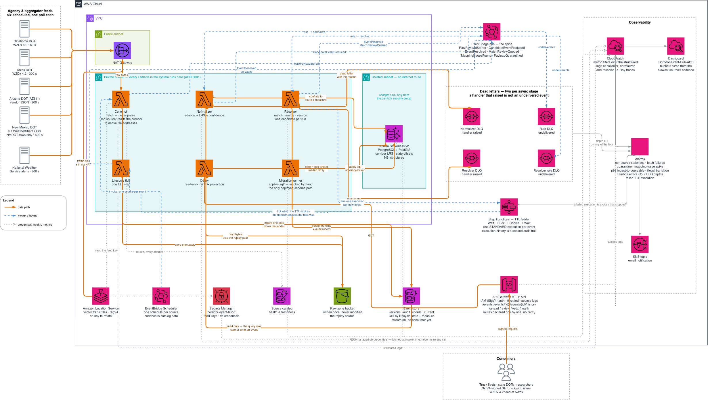

# Corridor Event Hub for ADS — Implementation

The working detail behind the [main README](../README.md) — which covers the document
map and deploying. This file is what you need once you have a
shell open in this directory, and every command below runs from here. The
source-by-source feed inventory is in
[docs/DATA-SOURCES.md](docs/DATA-SOURCES.md).

## Architecture



Three line styles — solid orange is the data path, blue
dashed is events and control, dotted is credentials, health and metrics — and the
annotations are load-bearing: *a failed execution is a clock that stopped*, and *the
first DLQ is the one that actually fires*. [Not built yet](#not-built-yet) is the
authoritative list of what the picture shows but the pipeline does not do yet.

---

## Try it right now — no AWS account needed

```bash
npm run setup
export CEH_USER_AGENT="YourApp (you@example.com)"
export OK_ODOT_TOKEN=<registry-token>  # optional; falls back to a fixture
export TX_DOT_KEY=<your-txdot-key>     # optional; falls back to a fixture
export AZ511_KEY=<your-az511-key>      # optional; falls back to a fixture
npm run probe
```

Each is optional. `probe` **skips a source it cannot authenticate and prints why**, naming
both the environment variable and the secret — a source silently omitted would look like a
state with no roadwork. The browser tools (`npm run ui`) fall back to the captured fixture
instead, and label it as fixture data. NWS, New Mexico and the traffic tiles need nothing at
all; the tiles use your own IAM credentials. `OK_ODOT_TOKEN` is new: the
Oklahoma token used to be committed to this repository, and it now resolves from Secrets
Manager or this variable like every other feed credential. It is genuinely public — get it from
the federal WorkZone Feed Registry, see [docs/OPERATING.md](docs/OPERATING.md#secrets).

This fetches live feeds, runs the real adapters, and prints candidate events plus
every mapping issue found. No credentials, no deploy. **Start here** — it shows
the actual data problems in about ten seconds.

```bash
npm test                    # 916 pass, 2 skip; state-line and dedup cases included
npm run ui-test             # 88 strip UI geometry and trust tests
npm run trace-ui-test       # 34 tracker derivation tests
npm run check               # everything CI checks, cheapest first
```

`npm run help` lists the commands worth knowing, grouped; bare `npm run` lists all
of them. Python lives in a venv, because the Lambda bundle needs a modern pip for
cross-platform wheels and macOS ships pip 21. Every Python script creates the venv
on first use, so `npm run setup` is only about getting the wait out of the way.
Override the interpreter with `PYTHON=/path/to/python3.13 npm run <script>`.

> **`make` still works, identically.** Every command below has a `make` twin with
> the same name — `make probe`, `make check`, `make db-migrate`. The [Makefile](Makefile)
> is kept because it documents *why* each step is shaped the way it is; the npm
> scripts are the same calls into the same `scripts/`.

> **npm, and `npm ci` for a reproducible install.** The three `package-lock.json`
> files — this directory, `ui/`, `ui-trace/` — pin the dependency tree, and they are
> what `npm run lint:deps` audits for advisories. Nothing else is locked or audited.

---

## Two UIs, in detail

Which one to open, what each answers, and the ports are in the
[main README](../README.md#two-uis). Below is how to run each one, what its panels
mean, and what to do when it does not come up. Both run at once — following a record
from the corridor view into its history is the normal workflow — and the tracker has
its own full guide in [ui-trace/README.md](ui-trace/README.md).

## Run the strip UI

```bash
npm run setup    # once, if you have not already
npm run ui
```

Then open **<http://localhost:5173>**. No AWS account, no login, no build step.

`npm run ui` installs the Python and UI deps itself, so it will install anything
missing rather than failing — `npm run setup` is only listed here so a first run does
not spend a minute looking idle while npm and pip work.

`npm run ui` starts **two** processes and stops both on a single Ctrl-C:

| Process | Port | What it does |
|---|---|---|
| `corridor_event_hub.strip_server` | 8787 | Runs the real adapters, serves the strip document at `/api/strip` |
| Vite dev server | 5173 | Serves the React app, proxies `/api` to :8787 |

**Prerequisites:** Python ≥ 3.9 and Node ≥ 18 (Vite 6 requires 18, 20, or ≥ 22).
Nothing else — a clean clone works from `npm run ui` alone.

### Variants

```bash
npm run serve            # the API alone on :8787, no front end
npm run serve-fixtures   # API from captured payloads only - never touches the network
npm run ui-build         # production build into ui/dist
npm run ui-test          # the 88 geometry and trust tests
npm run strip            # write docs/strip/data.json for scripting or archiving
```

`npm run serve-fixtures` is the **demo fallback**: it never makes a network call, so a
state feed being down cannot break a presentation. Run the front end against it with
`cd ui && npm run dev` in a second terminal.

### Feed keys are optional

Two sources need a key. Without one the adapter falls back to a captured payload and
the UI labels that row `fixture` rather than pretending it is live — so the app
always works, it just shows less live data.

Either set the keys directly:

```bash
export TX_DOT_KEY=...     # TxDOT
export AZ511_KEY=...      # AZ511
```

…or let the API read them from Secrets Manager, which needs only a profile:

```bash
export AWS_PROFILE=<your-profile>
npm run ui     # startup line confirms whether keys will resolve
```

`npm run ui` prints which of the two it is before starting, and `Source health` in the
UI names the specific reason for any row that fell back — not a generic "set the env
var", which is usually the wrong advice.

**If keyed feeds fall back despite a profile being set**, it is almost always PATH
rather than credentials. `npm run ui` adds the standard installer locations to PATH
because two different binaries have to be findable:

| Missing | Symptom |
|---|---|
| `aws` | An IDE- or npm-launched shell has a narrower PATH than your terminal, so the CLI is absent even though it works when you type it. |
| the `credential_process` helper | A profile using `credential_process = <helper> …` makes `aws` shell out to that helper. If the helper is missing, `aws` runs and fails with `[Errno 2] No such file or directory: '<helper>'` — which reads like a missing AWS CLI and is not. |

### What you are looking at

- **One row per source**, plus a **MERGED** row of canonical events beneath them.
  The gap between the two is the cross-agency dedup story.
- **Each row splits by direction** — `EB >` above, `< WB` below. These are
  directions of travel, **not lanes of road**: agencies report one physical work
  zone as two records, one per direction.
- **Click any bar** for provenance, the confidence breakdown component by component,
  and why a merge happened — or why an ambiguous pair went to review instead.
- **The header shows how old the data is**, colour-coded. It polls every 30s; the
  API re-runs the adapters at most every 20s because AZ511 allows only ten requests
  per minute.
- **Drag on the chart to zoom**, or pick a state from the dropdown.
- **`look-ahead`** drops a truck on the corridor and answers the question the actual
  consumer asks: given position, heading, and distance, what is ahead?

Full detail, including how to read empty rows and why `0 events` is often correct,
is in **[ui/README.md](ui/README.md)**.

### If it does not come up

| Symptom | Cause |
|---|---|
| `Cannot reach the API` in the browser | The Python half died. Run `npm run serve` alone to see its traceback. |
| `Port 8787 is already in use by pid N` | A previous run was killed hard and left the API behind. The script refuses to start rather than let a fresh front end talk to a stale server, and prints the `kill` to run. |
| `Port 5173 is already in use` | Same, for the front end. Vite uses `strictPort` on purpose so it cannot quietly move to :5174 and talk to the wrong API. |
| Header says `0/5 feeds live` | No network, or every feed is down. The rows fall back to fixtures and say so — the app still works. |
| A stray API after a hard kill | `pkill -f corridor_event_hub.strip_server` |

---

## Run the record tracker

```bash
export AWS_PROFILE=<your-profile>    # required - everything here comes from the cloud
npm run trace-ui
```

Then open **<http://localhost:5174>**. Read-only, and structurally so: every AWS call
underneath is a `Get`/`Query`/`Describe`/`List`, and there is no write path at all.

The strip above holds no state between builds — every event is first-seen on every
build and its TTL countdown restarts, which its own payload states as
`historyAvailable: false`. The history a record actually has lives in the deployed
event store: an append-only version chain, an audit record behind every transition,
and a pointer to the exact S3 bytes that caused each one. This is the view of that.

| Command | Does |
|---|---|
| `npm run trace-ui` | Both processes. The one to use. |
| `npm run trace` | The API alone on :8788 — prints the account, table and bucket it resolved before serving |
| `npm run trace-ui-test` | The 34 derivation tests |
| `npm run trace-ui-build` | Production build into `ui-trace/dist` |

Four layers per record, coarsest first: **findings** (what is wrong), **stages**
(ingest → normalize → resolve → lifecycle → end of life, each stating its evidence),
**time in each state**, and every **step** with its trigger, actor, reason, both
clocks, its version diff, and a link to the raw agency payload it came from.

### What it found on its first run against live data

Both of these were real, and neither is visible from the strip:

- **An Oklahoma work zone with 1,564 immutable versions in 26 hours** — one per
  60-second poll — where every diff contained nothing but `raw_ref` and `retrieved_at`
  moving. The cause is upstream and already documented in
  `adapters/ok_odot_wzdx.regenerated_end_date_minutes`: ODOT computes `end_date` as
  request-time + a fixed offset, so the candidate's content hash differs on every
  fetch, content-hash idempotency cannot fire, and "how many times did this event
  actually change" — the question the version chain answers — is buried under
  1,563 confirmations. The tracker raises it as a `version_churn` finding.
- **Every routine re-report initially read as an illegal transition**, because the
  transition table has no `active -> active` edge — correctly, since a confirmation is
  not a transition. Fixed in `core/trace.py`, and the distinction is now asserted by a
  test rather than left to a reader's judgement.

### Discovery, not hardcoding

Every table name, bucket and ARN comes from the deployed CloudFormation outputs, the
same rule `scripts/db.sh` follows: literal ARNs from one account silently keep
"working" against the wrong one, and the failure looks like an empty corridor rather
than a misconfiguration. The account and table are in the UI header for the same
reason. `EVENT_TABLE=<name>` or `CEH_INGEST_STACK=<name>` override it.

### If it does not come up

| Symptom | Cause |
|---|---|
| `cloud_unavailable` with a profile and region in the message | Credentials, usually an expired SSO session. The message names what it tried. |
| `stack CorridorEventHubIngest was not readable` | Not deployed in this account, or the shell points elsewhere. `npm run deploy`, or set `CEH_INGEST_STACK`. |
| Empty record list, pipeline tab healthy | A genuinely quiet corridor. Widen the lifecycle-state chips to include `cleared`. |
| Empty record list, dead-letter queues non-zero | Records that never reached the store. `npm run dlq-peek`. |
| `Port 8788 is already in use by pid N` | A previous run left the API behind; the script prints the `kill` rather than let a fresh front end talk to a stale server. |
| A stray API after a hard kill | `pkill -f corridor_event_hub.trace_server` |

---

## Spatial database (Aurora PostGIS)

```bash
npm run db-info           # which account/cluster/secret am I pointed at?
npm run db                # smoke test: postgis, row counts, LRS invariant
npm run db-check          # every read-only check: inventory, geometry, NBI, landmarks
npm run db-migrate-plan   # what a migration WOULD apply. Changes nothing.
npm run db-migrate        # apply pending sql/ migrations
npm run db-history        # what has been applied, and when

./scripts/db.sh "SELECT * FROM state_segment ORDER BY corridor_offset"
```

**After a first deploy, run `npm run db-migrate` — nothing does it for you.** A new
cluster has no PostGIS extension, no corridor tables and no centerline. The migration
function is deployed but invoked **on request, not as a deploy-time custom resource**,
and deliberately so: the CDK Provider framework would place its helper functions
outside the VPC ([ADR 0001](docs/adr/0001-all-lambdas-in-vpc.md)), and a schema
change as a side effect of shipping code is the wrong default for a system a DOT
operates. Applying the schema is a decision someone makes.

**Skipping it fails loudly, and not in the way this used to claim.** Measured on a
real deploy on 2026-09-15: the normalizer raised on every invocation, exhausted its
retries and dead-lettered **104 payloads** in about 35 minutes, first with
`InterfaceError: Can't create a connection to host …:5432 (timeout)` and then, once
the cluster was reachable, with `DatabaseError … 42P01 relation "corridor" does not
exist`. `CorridorEventHub-normalizer-dlq` went to ALARM. Nothing degraded quietly;
the ingest stage stopped.

The fallback in `HybridConflator` is real but narrower than the whole handler — it
covers polygon conflation, dropping weather-alert extents from exact to a ~3.1-mile
floor and logging `polygon_conflation_fell_back_to_sampling`. It does not cover the
corridor load itself, which is what a missing schema breaks first.

The recovery is cheap, which is the part worth knowing: run the migration, then
`npm run dlq-replay` re-normalizes from the original S3 bytes, so nothing collected
during the outage is lost. Run `npm run db-migrate-plan` first; on a new cluster it
lists every file as pending.

**Changing the schema:** `sql/001-init.sql` holds the current shape and is declared
`-- migration: repeatable`, so for additive changes edit it and re-run
`npm run db-migrate`. For anything destructive or one-shot, add `sql/003-*.sql` — those
are run-once, and editing one after it has been applied is reported as drift rather
than silently re-run. Full workflow in
[docs/SPATIAL-DB.md](docs/SPATIAL-DB.md); the schema itself is documented there too.

`npm run db-migrate` runs a **Lambda inside the VPC** rather than going through the
Data API, which is what lets it record every application in `schema_migration` and
wrap each file in one transaction — so a file either applied or it did not. It also
keeps working on a deployment that turns the Data API off, which
[docs/SPATIAL-DB.md](docs/SPATIAL-DB.md) recommends for production.

Database is `corridoreventhub` (no hyphen). ARNs and the function name are discovered per
account, so these work against any deployment. The cluster is in an isolated subnet
with no public endpoint — the migration path is the in-VPC Lambda, and everything
else goes over the RDS Data API.

## Monitor a deployed stack

```bash
npm run status                    # health of everything, one screen
npm run logs                      # live tail, both functions interleaved
npm run invoke -- ok-odot-wzdx    # force a run, follow it end to end
```

Full guide with observed baselines: **[docs/OPERATING.md](docs/OPERATING.md)**.

## What the live data actually looks like

The adapters were written against real payloads, so they handle real problems:

- **Oklahoma I-40 records carry `lanes: []` and `vehicle_impact: "unknown"`.** No
  lane detail at all. The adapter records the gap rather than inventing lanes.
- **`end_date: 2029-08-05T22:16:48.351Z`** — a 3.5-year work zone stated to the
  millisecond. Synthetic. The adapter rejects it and publishes `endTime: null`,
  keeping the raw value in extensions.
- **Direction encoded twice** — `direction: "westbound"` *and* `road_names:
  ["I-40 W"]`. Normalized, with disagreements flagged.
- **20 of 31 NWS alerts had `geometry: null`**, carrying only UGC zone codes.
  They cannot be placed without a zone shapefile join, so they are reported as
  issues, not guessed at. This is a real work item to budget for.
- **TxDOT writes `IH0040`, not `I-40`.** A naive route match finds **zero of
  2,059** Texas records. The pipeline would have looked healthy while dropping an
  entire state. A test asserts this specific failure cannot recur.
- **WZDx 4.2 replaced 4.0's `start_date_accuracy` strings with
  `is_start_date_verified` booleans**, and moved feed metadata from
  `road_event_feed_info` to `feed_info`. Same spec family, incompatible fields.
- **TxDOT has more lane information than Oklahoma and less structure to hold
  it**: `lanes: []` on all 2,059 records, but `vehicle_impact` is populated and
  descriptions carry HTML like `- Left lane closed.<br/>`. The adapter derives a
  full closure where it safely can and refuses to invent lane ordinals where it
  cannot.

- **AZ511 timestamps are UNIX EPOCH SECONDS**, not ISO 8601. A naive parse yields
  1970, which would silently corrupt every TTL timer downstream. `epoch_to_iso()`
  returns `None` rather than a plausible wrong answer, and rejects millisecond
  epochs too — a unit switch would otherwise land in the year 58000.
- **AZ511 `DirectionOfTravel` has twelve spellings**, including blank, `None`,
  `Unknown`, and north/south variants on an east-west corridor. Blank is mapped to
  `UNKNOWN`, never to `BOTH`: coercing unknown to both directions would over-report
  impact.
- **`Severity` is blank on 1,933 of 2,453 AZ511 records** and the literal string
  `None` on 32 more. Neither means "no impact", so both become `null`.
- **One AZ511 record had a police dispatch blob pasted into `RoadwayName`**, and
  `40TH ST` appears eight times. Route matching is anchored (`^I-?40\b`) rather than
  a substring test, which a naive `'40' in name` would have accepted.
- **The default `urllib` User-Agent gets a 403 from oktraffic.org** — Cloudflare
  rejects `Python-urllib/3.x` with `error code: 1010` while serving the identical
  URL to curl. An entire state's feed vanishes behind what looks like an auth
  failure. Every request now sends an identifying UA; a test asserts it.

Every one of these is a mapping issue in the probe output rather than a silent
default. That is the record-rather-than-drop rule working.

## Three things to know before extending it

**1. The centerline is real, and the flag that says so is earned.** The geometry
now comes from the federal NTAD National Highway System, with the corridor
measure carried per vertex rather than derived from a fraction and Oklahoma's
mileposts calibrated from posted-marker offsets. Positional accuracy across the
live fixtures is 50–388 m, down from 1.6–2.2 km on the placeholder it replaced.

`reference/corridor.json` says `verified: true`, and `scripts/fetch-arnold.py` only
writes that when the seven-landmark check passes — so a bad fetch cannot claim it.
(The corridor moved out of `config/` because a corridor in the deployment bundle is
one route, frozen at build time; production reads corridors from Postgres, keyed by
route, and this file is the offline source.)
Rebuild with `npm run corridor`. State mileages are measured now too, which is what
makes the state-line identity exact.

Read [docs/CORRIDOR-GEOMETRY.md](docs/CORRIDOR-GEOMETRY.md) before touching any of
it. The placeholder was not merely imprecise: it was **discarding events**, and it
had taken the test suite with it — four tests asserted the data loss as expected
behaviour, and several fixtures used town centroids as "on I-40" coordinates.
Open Question 5 is effectively answered: each state's own LRS, chained.

**2. A record disappearing from a feed means UNKNOWN, not CLEARED.** The most
consequential decision here, and the easiest to break by accident. See
[ADR 0003](docs/adr/0003-source-absent-means-unknown.md). Four phone calls to
four DOTs are outstanding; the catalog tracks them.

**3. Adapters must not dedup, score, or set lifecycle state.** The contract is
`parse -> field map -> vocabulary map -> conflate -> emit`. The model helps — an
adapter can only return `CandidateEvent`, which has no field for a lifecycle state
or a confidence score, so there is nothing to set — but the discipline is human.
"Adapters accumulate business logic" is how the reference architecture stops
generalizing.

## Not built yet

Each of these was left out deliberately, and the reason is recorded rather than
assumed. These are what change what you may claim about the pipeline — read them
before quoting status anywhere:

| Gap | Blocked on |
|---|---|
| `source_absent` handling ([ADR 0003](docs/adr/0003-source-absent-means-unknown.md)) | Four phone calls: does a record leaving a feed mean cleared or unknown? The policy exists ([`core/lifecycle.py`](corridor_event_hub/core/lifecycle.py)); nothing diffs two snapshots to detect an absence in the first place |
| Un-merge and re-open | Nothing — both edges are legal in the transition table, neither has a code path, and `MATCHABLE_STATES` excludes `cleared` so re-open is unreachable |
| Latency verified under 10× load | Nothing has generated 10× load, so the p95 ≤ 90s number is a one-× measurement |
| Merge and review thresholds, and `cluster_candidates`' single-link transitivity | Judgement rather than code — the thresholds are still whiteboard numbers. The resolver takes the incremental path (best match against the store) and so does not inherit the transitivity limitation, but the batch clustering behind the strip view still has it |
