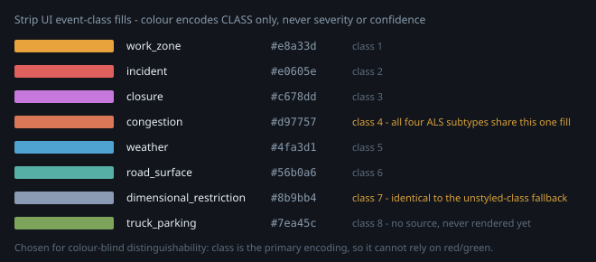

# Corridor Event Hub for ADS — Data Source Status

Probed live. Every status below was verified by an actual HTTP request, not
inferred from documentation.

---

## Where the classes stand

These are the classes of this pipeline's own taxonomy (`EVENT_CLASSES` in
[src/corridor_event_hub/core/types.py](../corridor_event_hub/core/types.py)).
**Any coverage figure below counts against that taxonomy and no other.** An
adopter working from a different class list will not get the same count — see the
note above `EVENT_CLASSES` for why the names here are deliberately not chased to
fit an external one.

| # | Class | Status | Source | Can we build now? |
|---|---|---|---|---|
| 1 | **Work zone** | ✅ **Working** | OK ODOT WZDx 4.0, TxDOT WZDx 4.2 | Yes — deployed |
| 5 | **Weather** | ✅ **Working** | NWS alerts | Yes — deployed |
| 6 | **Road surface** | ⚠️ **Partial** | NWS (derived from winter/ice/flood alerts) · NMDOT explicit road-condition reports | Partly — real sensing needs RWIS |
| 7 | **Bridge clearance** | ✅ **Built as reference data** | FHWA NBI bulk download — **1,543 corridor structures loaded and conflated, 387 with a known clearance** · AZ511 `restrictionClass` mapped | Done; not a live event feed and does not need to be |
| 2 | **Incident** | ✅ **Working** | AZ511 API | Yes — deployed |
| 3 | **Closure** | ✅ **Working** | AZ511 API (same feed) | Yes — deployed |
| 4 | **Congestion** | ⚠️ **Working, INTERIM** | Amazon Location `vector.traffic` tiles (HERE data) — **stopgap**, to be replaced by NPMRDS/commercial probe | Yes — deployed, but **NOT redistributable** |

Class 6 has **one genuinely sourced** feed rather than only derived data — NMDOT
publishes explicit "Roads are wet" / "Difficult Driving Conditions" reports
(`nm-dot-weathershare`). Caltrans RWIS, which looked like the answer, has **no
pavement sensors on I-40** and does not close it.

So: **seven classes have data** — six off live feeds, plus bridge clearance as
conflated NBI reference data.

What none of these rows measure: **New Mexico depth**. All four states have an adapter, but NM's only live source carries 2 points
on NM I-40 across `closure`, `work_zone`, and `road_surface` — no incident data. Any
evaluation focused on a single stretch of the corridor should check per-state depth
before per-class coverage.

Congestion no longer *blocks* on RITIS. Amazon Location Service publishes a
`vector.traffic` tileset carrying numeric `speed` and `congestion` per segment
plus a `traffic_incidents` layer, authenticated with IAM rather than an API key —
so the pipeline already had the credential. Two caveats that matter more than the
win: the tiles carry **no confidence field**, so an observed speed cannot be told
apart from a historical average, and the licence is HERE's, so the data is **not
publishable**. Details in the `aws-location-traffic` catalog entry.

**Treat this source as temporary.** It unblocked class 4 and it stays until
something better is contracted, but the two caveats above are structural — they
cannot be fixed by improving the adapter, because the tile schema does not carry
the missing fields. The intended replacement is **NPMRDS via RITIS** (or a
commercial probe feed with redistribution rights), which restores confidence
bands, provenance, direction, TMC referencing, and a licence the public API can
actually serve. Until that lands, class 4 is evaluation-grade, not publishable.

**All four states now have a live feed**, and all four have a
working *adapter* — New Mexico was the last gap, closed by `nm-dot-weathershare`.

---

## Redistribution terms, with references

`redistributable` in [config/sources.json](../config/sources.json) drives real
behaviour — the strip export and the WZDx projection both refuse to republish a source
marked `false` — so the flag needs a reference behind it rather than a recollection.
**Verified 2026-09-15.** References, not legal advice; re-check before a release.

| Source | Redistributable | Reference |
|---|---|---|
| **Oklahoma ODOT WZDx** | ✅ Yes | The feed **declares its own licence in-band**: `road_event_feed_info.license` = `https://creativecommons.org/publicdomain/zero/1.0/` (CC0-1.0) |
| **Texas DOT WZDx** | ✅ Yes | Same, in `feed_info.license` |
| **NWS alerts** | ✅ Yes | <https://www.weather.gov/disclaimer> — NWS information "are in the public domain … and may be used without charge for any lawful purpose", subject to three conditions below. Also 17 U.S.C. § 105 |
| **NBI bridge clearance** | ✅ Yes | FHWA publication, US federal public domain |
| **AZ511 events** | ❓ **Unknown** | Never confirmed with ADOT. Vendor-operated platform |
| **NM DOT WeatherShare** | ❓ **Unknown** | Aggregator terms unstated, and the originating NMDOT terms unconfirmed |
| **Amazon Location traffic tiles** | ❌ **No** | HERE content sublicensed via AWS; attribution mandatory, republication not licensed |

Two things worth stating rather than leaving implied:

- **The two CC0 grants are not incidental.** The WZDx specification *requires*
  `feed_info.license` to be exactly that URL — an enum of one, see
  [reference/wzdx/4.2/FeedInfo.json](../reference/wzdx/4.2/FeedInfo.json) — so a
  conformant WZDx feed is CC0 by construction, and both of these comply. It is the
  strongest form of evidence available: asserted by the publisher, inside the bytes.
- **NWS attaches three conditions, not none:** do not claim it as your own, do not
  imply NOAA/NWS endorsement, and do not modify it and present the result as official
  government material. Unmodified, attributed capture satisfies all three; a
  *synthesized* NWS payload would fail the third.

**`Unknown` is treated as `not granted`** — the same default the lifecycle applies to a
source that goes silent (ADR 0003). That is why three of the six test fixtures are
generated rather than captured: see
[tests/fixtures/README.md](../tests/fixtures/README.md). Confirming terms with ADOT or
the WeatherShare operator would let those two go back to being captures, which is
strictly better for the tests — it is an open item, not a closed decision.

### The published WZDx feed enforces this, since 2026-09-16

`to_wzdx_feed` now checks the catalog before it projects, and **excludes any event with
a contributing source that is not explicitly `redistributable: true`** — counted and
explained, like a missing geometry. `may_republish()` in
[core/wzdx.py](../corridor_event_hub/core/wzdx.py) is the single gate.

This was found in a **deployed** feed, not in review. `/wzdx` was serving 6 of 24
features attributed to `aws-location-traffic`. Nothing was wrong with the class
filter — an Amazon Location `traffic_incidents` feature with `kind: construction`
legitimately maps to `work_zone`, and `work_zone` is legitimately publishable. The
licence was simply never consulted on the way out. `PUBLISHABLE_CLASSES` answers *is
this the right kind of event*; only this answers *may we republish it at all*.

**One blocked contributor disqualifies the whole event.** A merged record carries
fields from every source that contributed, so a majority vote would republish the
licensed part of a merged record and attribute it to whichever agency happened to be
`sources[0]` — worse than publishing it plainly.

The cost is real and worth stating: on the captured/generated fixture set the feed goes
from **14 features to 2**, because AZ511 and WeatherShare are `unknown` rather than
refused. Those two are one confirmation away from returning — the exclusion reason says
`redistribution terms unconfirmed` rather than `licence forbids republication`
specifically so a flat count cannot hide the difference. Only Amazon Location is a
permanent exclusion.

---

## California sources — probed and cataloged

Six catalog entries, all **public, no key, no registration**, all verified live. Two
matter; the rest are narrower than they look.

| Source | Classes | On CA I-40 | Verdict |
|---|---|---|---|
| `ca-cwwp2-lcs` lane closures | closure, work_zone | 32 records (≈5 real closures) | **Richest closure schema in the catalog** |
| `ca-cwwp2-rwis` weather stations | weather (**not** road_surface) | 2 stations, **0 pavement sensors** | Weather only — does **not** close class 6 |
| `ca-cwwp2-cms` message signs | — (enrichment) | 3 signs, 1 displaying | Text, but **not locatable** |
| `ca-cwwp2-cctv` cameras | — (verification) | **1 camera** | Superseded — see [cameras](#cameras-103-on-the-corridor-all-keyless) |
| `chp-cad` CHP dispatch | incident, closure | 1 active | Genuinely independent of Caltrans |
| `nm-dot-weathershare` aggregator | multi | 2 on NM I-40 | **Carries NMDOT, no key — now built** |

Chain control (`ccStatusD08.json`) is live but returned **zero I-40 records** —
CA I-40 is desert, so chain controls sit on I-15, SR-2 and SR-18. Not
cataloged.

### The two findings that mattered

**1. WeatherShare carries NMDOT — the state with no working feed.** `nm-dot-wzdx`
has been returning 503. WeatherShare's `roadinfo` dataset has 84 live NMDOT
records right now, including real I-40 lane detail (*"Eastbound driving lane
closed on I-40, mile marker 44-46, Coolidge Interchange to 20 miles east of
Gallup"*). It also carries 290 ADOT sign records with no API key. **This is a
route into New Mexico that needs no agency contact.** Now built — see
[the NM adapter section](#new-mexico-is-live--nm-dot-weathershare).

One record in this feed reads as I-40 class-7 data and is not: *"Low Clearance
Structure, CMV's please use I-40 between exits 89 & 96. Height Restriction 13'6""*.
Structural route matching shows it carries `routeName: "NA"` — it is a restriction
**somewhere else** that recommends I-40 as the truck detour. Admitting it would
publish a 13'6" clearance limit on the corridor it tells trucks to use. See the
route-matching note below; this is now the adapter's most pointed test.

**2. It independently confirms our NTCIP unit decoding.** WeatherShare reports
the Barstow I-40 station as `100.58 °F / 11.18 mph / 20.67 mi`; the raw Caltrans
feed reports `381 / 50 / 332700`. Tenths of °C, tenths of m/s, and **decimetres**.
Getting a second implementation to agree on that is arguably worth more than the
data — it is the class of error that produces plausible numbers.

### RWIS does not close class 6, and that is the headline

DATA-SOURCES.md has listed real road-surface sensing as blocked. Caltrans RWIS
looked like the answer and **is not**, on this corridor. Both I-40 stations
report `numEssPavementSensors = 0` — no surface status, no surface temperature,
no freeze point. The five D8 stations that *do* have pavement sensors are on
I-15, SR-2, SR-18 and SR-138: mountain routes where chain control matters.
Caltrans instrumented I-40 for wind and visibility, not ice.

So on I-40 this is a **weather** source. Class 6 stays derived. The instinct to
close it by finding an RWIS feed was right in kind and wrong in fact, and only a
per-station field check showed that — a station count would have hidden it.

### Traps found, all verified live, all silent

The full list is in each catalog entry. The five worth reading here:

**A sign is not where its event is.** The I-40 sign at Barstow was displaying
`HWY-15 CLOSED / 15-N AT JEAN / USE ALT RTE`. Jean is in **Nevada**, on I-15,
~150 miles away, not on I-40 at all. The same message appeared on five signs —
one upstream event, five signs, zero of them at the event. Geocoding sign text to
the sign's coordinates manufactures phantom corridor closures. This is why both
`ca-cwwp2-cms` and `ca-cwwp2-cctv` carry `eventClasses: []` on purpose: they
corroborate candidates, they never originate them.

**Camera freshness is not in the camera feed.** `recordTimestamp` on CCTV records
is the *inventory* date — over a year stale — while the JPEG behind it was two
minutes old. Trusting it would age every frame by a year and trip every freshness
alarm. Use the image's HTTP `Last-Modified` or its EXIF datetime. Related:
`streamingVideoURL` is aspirational — the I-40 camera's HLS playlist 404s, and 2
of 3 other D8 cameras sampled also 404. **Still images work, streams mostly do
not.** Each camera does advertise 10 prior frames at 15-minute intervals, which
is a free short time series no other source offers.

**2,064 AZDOT records in WeatherShare are empty shells.** Every one carries only
`{source, typeabbr, starttime:'', endtime:'', updated:null}` — no coordinates, no
route, no description. That is 38% of the file and **zero usable AZ records**
despite the promising count. A record count is not a data count.

**CHP omits the longitude sign.** `LATLON` `"34817195:116615860"` means
`34.817195, -116.615860`. The minus is implicit. Decoded naively it lands in
China. Every text value is also wrapped in *literal* quote characters inside the
XML element, so an empty field is the two-character string `""`, not `""`.

**Another 1970, in a new disguise.** NMDOT sign records carry `message_date:
"1969-12-31"`, `"16:59:59"` — epoch 0 in US Pacific. It does not *look* like
1970 and it sorts as a real date.

### PeMS: not usable as a feed

`pems.dot.ca.gov` responds, but the Clearinghouse is behind a login/registration
wall (`Username`/`password`/`Register` in the markup) and PeMS is an **archival**
system — 5-minute aggregates of loop detectors after the fact. Same shape of
problem as NPMRDS: it cannot answer "is there a queue right now", which
`aws-location-traffic` already does. Useful for historical baselines and for the CA
equivalent of TMC referencing. Not cataloged, since there is no anonymous endpoint
to point an entry at.

---

## New Mexico is live — `nm-dot-weathershare`

**All four corridor states now have a working adapter**, which
was not true this morning: `nm-dot-wzdx` (NMDOT via Blyncsy) has been returning
503, and this reaches the same agency's data through the WeatherShare aggregator
with no key and no agency contact.

Live end-to-end: HTTP 200, 4.05 MB, 546 ms, **2 I-40 candidates** (1 work zone,
1 closure), 0 off-corridor, 7 mapping issues. Extents land at NM MP 344–350 and
NM MP 44–46.

**Scoped to NMDOT deliberately.** The endpoint serves 8 agencies at once
(2,499 Caltrans, 2,064 AZDOT, 250 MDOT, 216 WSDOT, 154 OregonDOT, 84 NMDOT, 76
UDOT, 64 NDOT). Reading all of them would need an `independenceGroup` correct for
none — a re-served ADOT closure would corroborate *the same closure* from
`az511-events`. Filtering to one upstream makes `independenceGroup: nmdot`
true rather than approximate, and sidesteps the CA corridor re-basing question
entirely. Reading the others still requires per-candidate independence, which is a
schema change.

### Why the milepost wins whenever it resolves

NMDOT states positions as prose mile markers on 52 of 84 records, and the adapter
parses them and prefers them over the record's own coordinate. Four reasons, and
they were measured rather than assumed:

1. **It is the agency's own linear reference.** The corridor LRS is built on state
   mileposts, so "mile marker 344" is NMDOT stating a position in the system its
   maintenance records use.
2. **It gives a linear extent.** 52 of 84 records state a range; the coordinate is a
   single point, so preferring the point collapses a 6-mile work zone to a dot.
3. **The confidence model already ranks it higher** — `milepost` scores 0.9 for
   spatial precision against `coordinate`'s 0.85.
4. **It surfaced a real defect in our own geometry.** Against the placeholder
   centerline this adapter first ran on, the Gallup lane closure's coordinate fell
   *outside* the 1600 m corridor buffer and would have been discarded as
   off-corridor; its milepost resolved cleanly. The centerline has since been
   rebuilt from the federal NTAD National Highway System, with Oklahoma measure
   offsets calibrated separately — see [CORRIDOR-GEOMETRY.md](CORRIDOR-GEOMETRY.md)
   — which is why the yield gain on the current fixture is zero. The parser still
   earns its place for records with no coordinate at all, and for the linear extent.

The adapter records the milepost-vs-coordinate gap on every record
(`nmws_milepost_coordinate_gap_miles`) and reports it above a 25-mile threshold, so
a disagreement between the two referencing systems is measured across the corpus
rather than estimated.

### Route matching must be structural, not textual

Five NMDOT records mention I-40 in their prose; **only two are on it.** The three
false positives name it as a landmark (*"at mile marker 0, Church Rock (I-40)"*,
*"6 miles north of I-40"*) or as a detour (the height-restriction record above).
The adapter matches on `routeName` + `routeNumber`, because the feed splits the
route across two fields and never writes the string "I-40" at all.

### What NMDOT genuinely adds, and what it withholds

**Adds: real agency road-surface reports.** `eventType` 13/16 are *"Fair Driving
Conditions - Roads are wet"* and *"Difficult Driving Conditions"* — 25 of 84
records. Class 6 everywhere else in this catalog is derived from NWS alerts, or
absent because Caltrans put no pavement sensors on I-40. None were on I-40 at probe
time, but the class is now genuinely *sourced* rather than inferred.

**Withholds three things, all handled and all reported per record:**

- **No record id.** Nothing on any of the 84 records identifies it — no `id`,
  `uid`, `log-id`, or `index`. `native_id` is synthesized from route + title +
  coordinates rounded to 4 dp, deliberately excluding the description body (edited
  as conditions change) and `updated` (changes every scrape), or the same event
  would get a new identity on nearly every poll. A title edit still mints a new id;
  the matcher's spatial overlap has to absorb that.
- **No event times.** `starttime` and `endtime` are the empty string on all 84
  records. `start_time` falls back to our own retrieval time with
  `time_confidence: estimated`, `end_time` is open-ended, and both are reported so
  a fetch time is never mistaken for an agency-stated one. `updated` is
  byte-identical across all 84 records — it is the aggregator's scrape time, not a
  per-record update.
- **An undocumented numeric `eventType` enum.** Correlated 1:1 against rendered
  titles across all 84 records with no crossover: 5=Closure, 8=Lane Closure,
  9=Roadwork, 13=Fair Driving, 16=Difficult Driving, 20=Seasonal Closure. Strong
  evidence, still inference. **7 (`Alert`, 16 records) and 19 (n=1) are
  deliberately unmapped** — 17 of 84 quarantined rather than guessed, because
  "Alert" spans dimensional restrictions, truck prohibitions, and non-events.

### A latent bug recorded rather than silently fixed (NM)

`nm-dot-wzdx` carries `independenceGroup: "blyncsy"` (the vendor hosting it), but
its data is also NMDOT's. If that feed comes back, it and `nm-dot-weathershare`
would look independent and corroborate each other — two routes to one agency's
report, exactly the `aws-location-traffic`/HERE situation. Harmless only because
`nm-dot-wzdx` is `endpoint_down` with no adapter. **Move it to `nmdot` before
reviving it**, and prefer it over the aggregator when it returns.

---

## Cameras: 103 on the corridor, all keyless

Probed live. A CA-only view of the portal reports **1** camera; the corridor
actually has:

| State | Agency | I-40 cameras | Resolution | Coverage quality |
|---|---|---|---|---|
| **AZ** | ADOT | **39 live feeds** | 1280×720 | **Even, MP 8–359, no gap >40 mi** |
| **NM** | NMDOT | **63** | 800×450 | **Metro-heavy** — see below |
| CA | Caltrans | 1 | 320×260 | one rest area |
| **TX, OK** | — | **0** | — | absent from the portal entirely |

Sampled 24 image URLs: **23 returned real JPEGs** (AZ 11/12, NM 12/12). No key, no
registration, no referer requirement.

**Arizona is the one with real corridor coverage.** 39 feeds across 26 distinct
mileposts spanning MP 8 to 359 of a 359.5-mile state segment, 18 EB / 18 WB / 2 NB,
with no gap wider than 40 miles. Nearly any AZ candidate has a camera within ~20
miles.

**New Mexico's 63 is a smaller number than it looks.** They are concentrated in
Albuquerque — `I-40 @ Carlisle`, `@ 4th St`, `@ 12th St`, `@ 98th St`, `@ Coors`,
`@ Eubank`, `@ Louisiana`, `@ San Mateo`, `@ University`, `@ Unser`, `@ Wyoming`,
`@ Juan Tabo`, `@ Lomas`, `@ Tramway` — city interchanges. The rural corridor gets
about a dozen (Clines Corners, Continental Divide, Moriarty, Sedillo, Zuzax, Rio
Puerco, Santa Rosa, Tucumcari, Exit 36). 63 cameras, far less than 63 cameras'
worth of corridor.

### ADOT has a better route than the aggregator, and it is the only route

`az511.com/List/GetData/Cameras` answers an **unauthenticated POST**
(`draw=1&start=0&length=100` — it caps at 100 per page, 644 total across 7 pages)
and returns metadata the aggregator flattens away: `roadway: "I-40"` as a real
structured field, `county`, `latLng` as WKT, and per-image `disabled` / `blocked`
flags. Mileposts and direction parse cleanly out of the image description
(`"I-40 EB  184.50 @Bellemont"`).

This matters because **AZ511's official API has no camera endpoint** — `camera`
returns a genuine 404 with a valid key. The keyless DataTables endpoint is the only
way to ADOT imagery. Two caveats on it: a `GET` with the same parameters returns
`data: []` while the `POST` returns rows, and `length=2000` is silently capped at
100, so a single unpaged request looks like a complete answer and is 16% of one.

NMDOT images come from `servicev4.nmroads.com/RealMapWAR/GetCameraImage?cameraName=...`,
which has **no discoverable list endpoint** (`GetCameras`, `GetCameraList` both
404). So for NM the aggregator is the discovery mechanism for camera names, and the
two sources are complementary rather than redundant.

### Freshness: three agencies, three different broken signals

Measured directly, two fetches 70 seconds apart:

| | `Last-Modified` | Bytes changed in 70 s | Usable cadence signal |
|---|---|---|---|
| **AZ** | present, **advanced 22:37:16 → 22:38:29** | **no — byte-identical** | **None. The header advances while the frame does not.** `Cache-Control: max-age=30` |
| **NM** | **absent**, no `Cache-Control` either | yes | None from headers. EXIF `datetime` is the only capture time (AXIS Q6075-E) |
| **CA** | present and **honest** (22:33:09 → 22:36:10) | yes | ~3 min, matching the documented `currentImageUpdateFrequency: 3` |

The Arizona row is the trap: a naive "is this fresh?" check on `Last-Modified` would
report freshness that does not exist, because the header moves without a new frame.
For AZ, freshness has to be established by hashing the bytes. For NM there is no
header at all and the EXIF timestamp is the only honest answer. Only California can
be trusted to say when its own image was taken.

Related, and already noted for Caltrans: the **camera catalog** record dates are
inventory dates, not image dates. ADOT's `lastUpdated` was `2025-01-07` on a camera
serving a frame from minutes ago.

**One more trap:** one AZ camera returned an `image/png` placeholder (15 KB) instead
of an error. Content-type alone counts that as success. A fetch has to verify it got
a JPEG, not merely an image.

---

## Message signs on the corridor: 59, and one of them is genuinely useful

The aggregator's `cms` dataset carries **59 signs naming I-40 — 42 NMDOT and 17
ADOT — all 59 with coordinates.**

**ADOT: 17 signs, 14 displaying text.** Mostly travel times, which are a real
corridor congestion signal and are stated at corridor scale — `NM STATE LINE 44`,
`CA STATE LINE 112`, `ALBUQUERQUE 169`. And one sign is the find:

```
I-40 EB @ Flagstaff:   ROAD WORK / 30 MILES AHEAD / RIGHT LANE CLOSED
```

That is **a parseable distance offset plus lane detail**, and it partly defuses the
trap that made California's signs unusable. Caltrans signs stated an event with no
hint of where it was, which is how an I-15 closure in Nevada ended up displayed on
an I-40 sign at Barstow. ADOT signs state the offset themselves: sign coordinates +
direction + "30 MILES AHEAD" gives a computable event position. Still an inference,
but a bounded one rather than a guess.

**NMDOT: 42 signs, zero displaying anything.** All blank, all carrying the
`1969-12-31` / `16:59:59` epoch-0 sentinel. And many are not on the mainline at all
— `Carlisle NB @ I-40 Arterial` is an Albuquerque arterial sign named for the
freeway it crosses. Same class of naming trap as the NM 566 records: the string
"I-40" in a location name does not mean "on I-40".

Verdict: worth revisiting for ADOT specifically, because the offset syntax makes
sign text locatable. Not a priority — 14 live signs of which ~13 are travel times.

---

## Dead ends, recorded so nobody re-checks them

All probed live. Each responded; none carries corridor value.

| Dataset | What it returns | Why it is useless here |
|---|---|---|
| `AHPS/AHPS.json` | 12,414 records | Each is only `{lat, lon, name, value, zoom}` and **`name` is the constant string `"NWS AHPS"`** — no gauge id, no river. A map icon layer, not data. |
| `CURRENT_WEATHER/OSS/AirTemp` | 125 records | **Caltrans only**, and it is the same RWIS network already cataloged. |
| `CURRENT_WEATHER/OSS/Wind` | 127 records | Caltrans only. |
| `CURRENT_WEATHER/OSS/Humidity` | 120 records | Caltrans only. |
| `CURRENT_WEATHER/OSS/Precip1hr` | **empty** (4 bytes) | — |
| `CURRENT_WEATHER/OSS/Precip24hr` | **empty** (4 bytes) | — |
| `FORECAST_WEATHER/wx.json` | 57 bare integers | A list of timestamps. An index, not data. |
| `RWIS/OSS_rwis` | 392 stations | Sources are UDOT, Caltrans, Nevada DOT, Oregon DOT. **No AZ/NM/TX/OK station, none on I-40.** |
| `INCIDENTS/OSS_incidents` | 356 records | CHP, ITD, WSDOT, Oregon DOT, MDOT, UDOT. **No corridor state.** |
| `CHAIN/OSS_chain` | 19 records | Caltrans + WSDOT only. |
| `FIRE/*.json` | 404 on every name tried | Referenced by the page's JavaScript; no reachable path found. |
| `servicev4.nmroads.com` | image endpoint works | **No list API** — `GetCameras`, `GetCameraList` both 404. |
| PeMS Clearinghouse | login wall | Archival 5-minute aggregates; cannot answer "is there a queue now". |

**Texas and Oklahoma are absent from the entire WeatherShare portal** — every
dataset, every upstream. This confirms the naming collision flagged earlier:
**`ODOT` in this portal means Oregon**, not Oklahoma. The portal is a *western
states* aggregator, so it structurally covers CA/AZ/NM and can never cover the
eastern half of the corridor.

## NBI bridge clearance (class 7)

**Fully public. No key, no registration, no data agreement.** Verified working.

```
https://www.fhwa.dot.gov/bridge/nbi/2025/delimited/OK25.txt
```

- 22,926 Oklahoma structures; **409 on I-40**
- Per-state files: `AZ25.txt`, `NM25.txt`, `TX25.txt`, `OK25.txt`
- US federal public domain, so redistribution is unrestricted
- Has clearance, coordinates, and a structure identifier

**Built**, by `src/scripts/fetch-nbi.py` → `src/sql/003-nbi-structures.sql`.
It also exercises parts of the pipeline nothing else has touched: **an annual batch
source rather than a poll**, and a class whose lifecycle barely applies since the
facts are near-static.

### By the numbers (NBI 2025 vintage)

**The 1,176 rows labelled `carries` are not 1,176 bridges.** 461 of them are
culverts, and a divided highway is filed once per direction — so the same crossing
appears twice. Read the load as ~740 bridges plus ~460 culverts at ~974 physical
sites, not as a bridge count.

Downloaded vs loaded — the four annual files come whole, then are filtered to the
corridor:

| State | Statewide | Loaded (I-40) |
|---|---|---|
| AZ | 8,587 | 454 |
| NM | 4,033 | 374 |
| TX | 56,951 | 162 |
| OK | 22,926 | 553 |
| **Total** | **92,497** | **1,543** |

The 1,543 is a **union, not a sum** — a structure can qualify both ways:

- 1,199 pass the *carries* test (`ROUTE_PREFIX_005B = 1` and `ROUTE_NUMBER_005D = 40`)
- 369 pass the *crosses* test (`VERT_CLR_UND_REF_054A = H`, item 6A matches the corridor)
- **25 pass both** → union 1,543. Of those 25, 23 resolve to `relation = 'crosses'`
  because item 54B was the known or more restrictive reading, which is why the table
  stores 1,176 `carries` / 367 `crosses`

Composition of the 1,199 carries-set rows:

| | n | median length |
|---|---|---|
| Culverts (`STRUCTURE_TYPE_043B = 19`) | 461 | 9.9 m |
| Bridges (everything else) | 738 | 50.7 m |

- 574 rows carry a one-way direction code (`DIRECTION_005E` = 2 or 4); the facility
  text says EB on 374 and WB on 378 — the same crossing filed twice
- **974 distinct sites** when coordinates are clustered at ~110 m; 220 of them hold
  more than one structure
- 0.97 structures per corridor mile over 1,240.7 mi — unremarkable for a rural
  interstate crossing washes, county roads, frontage roads and interchange ramps

### Three traps in the data, all verified

**1. `99.99` is a sentinel, not a measurement.** In Oklahoma alone, 379 of its 409
I-40 structures carry `MIN_VERT_CLR_010 = 99.99`, meaning *no restriction*. Read
literally that is 99.99 metres of clearance, and any "is this truck too tall" check
would pass everything. Only **30 of 409** have a real clearance value. Two more
report `0`, which also has to mean unknown rather than zero clearance.

Corridor-wide the ratio is the same story: **1,154 of the 1,199** carries-set
structures report the sentinel and only **20** carry a real measurement — none of them
below 14 ft. That is what makes item 10 the wrong field for the over-height truck
query; the usable numbers are in item 54B. Two further sentinel families the catalog had not recorded
(30.48 m = exactly 100.00 ft, 30.45 m = 99.90 ft, 23 structures between them) are
documented in the `scripts/fetch-nbi.py` docstring.

**2. Latitude and longitude use different digit widths.** `LAT_016` is packed
`DDMMSSss` (8 digits), `LONG_017` is `DDDMMSSss` (9). Using one width for both
puts longitude near `-10.5` instead of `-99.2` — a plausible-looking number in
the Atlantic. With the widths correct, all 400 sampled structures decode inside
the corridor.

**3. The file is latin-1**, not UTF-8.

Each of these fails *silently*, which is why they are in the catalog rather than
discovered in week 3.

---

## AZ511 — deployed, and it settled two open questions

Key obtained and working. 2,453 statewide events, **30 on I-40**,
producing 9 corridor candidates across `work_zone` and `incident`.

**Endpoint discovery is settled: only `/event` exists.** With a valid key,
`roadwork`, `alert`, `winterroad`, `camera`, `message`, `service` and `restarea`
all return genuine 404s. So **AZ511 gives us no winter road conditions** — class 6
stays unsourced from Arizona, and the earlier hope that it might be covered is
closed off.

**It is the richest feed of the four.** Unlike the WZDx sources it has real
`LanesAffected` prose, a `LaneCount` number, an `IsFullClosure` boolean, and a
typed `Restrictions` object. It is the only source producing structured lane
ordinals today.

### Four traps, all handled

1. **Timestamps are UNIX EPOCH SECONDS**, not ISO 8601. A naive parse yields
   1970, which would break every lifecycle timer silently.
2. **`DirectionOfTravel` has twelve spellings**, including blank, `None`,
   `Unknown`, `All`, and north/south variants. North and south are not I-40
   directions — they resolve to UNKNOWN rather than being coerced to BOTH, since
   coercing would over-report impact in both directions.
3. **`Severity` is blank on 1,933 of 2,453 records** and the literal string
   `None` on 32 more. Neither means "no impact"; both map to null.
4. **One record had a police dispatch blob pasted into `RoadwayName`**, and
   `40TH ST` appears 8 times. Route matching is anchored (`^I-?40\b`) rather
   than a substring test.

### Two questions this feed does not answer

- **`Restrictions` units are undocumented.** `Width: 12.0` could be feet or
  metres, and for an over-height truck that is the difference between fine and
  not fitting. The adapter flags these rather than emitting a class-8 candidate.
  137 of 2,453 events carry a value, so this is worth resolving.
- **Redistribution terms are unknown.** Determines what the public API may
  expose.

Also unresolved but lower stakes: **`EncodedPolyline` is present on 27 of 30
I-40 events and not yet decoded**, so extents come from endpoint coordinates and
are coarser than the source allows.

---

## Congestion (class 4) — a working interim source

**Congestion (class 4) — unblocked, with an INTERIM source.** Was blocked twice
over: NPMRDS needs a RITIS account *and* is batch/lagged, so it could never answer
"is there a queue right now". Amazon Location Service's `vector.traffic` tileset
answers both — real-time, no signup, IAM-authenticated — and is now a working
adapter. Verified live: 17 tiles at z8 cover the corridor, returning
1,586 flow segments and 59 incidents including genuine `queuing` and `stationary`
traffic.

**This is a stopgap, not the class-4 answer.** The gaps below are properties of
the tile schema, not of the adapter, so no amount of adapter work closes them —
they close only by changing source. Plan on replacing it.

What it does **not** solve:

- **No confidence or provenance.** HERE's own API publishes bands stating whether
  a reading is observed, historical, or speed-limit-derived; the tile schema drops
  them. So the adapter marks every candidate `time_confidence: estimated` and the
  source sits in `independenceGroup: here` so it can never corroborate an
  agency-reported closure on its own.
- **No direction.** Each carriageway is a separate feature, but no heading is
  stated. "Queue eastbound" and "queue westbound" are different events to a truck,
  so direction is `UNKNOWN` and every candidate reports the gap to the review
  queue.
- **Not redistributable.** HERE licence terms, attribution mandatory. Fine for the
  pipeline; the public API must not expose it. Still a lawyer question.

**NPMRDS is still worth having** for historical baselines and for TMC referencing,
neither of which a live tile feed provides — it is just no longer the critical path
for class 4.

### What the tiles actually carry

Two useful layers, both keyed on an **undocumented `kind` enum**. A third,
`incident_icons`, is the same incidents repeated as label points and is skipped —
not data loss.

| Layer | `kind` values | Other fields | Becomes |
|---|---|---|---|
| `traffic_flow` | `free`, `none`, `minor`, `slow`, `queuing`, `stationary` | `speed` (km/h), `congestion` (0-1) | class 4 only; `free`/`none` are **dropped** |
| `traffic_incidents` | 12 mapped (`accident`, `construction`, `closure`, `road_hazard`, ...) | epoch `start_time`/`stop_time`, `warning_level` | classes 1, 2, 3, 5 |

Both carry a **stable `id`** — the only source giving the matcher a real
correlation key across polls instead of geometry overlap — plus road
classification (`road_kind`, `road_kind_detail`, `network`,
`is_link`/`is_bridge`/`is_tunnel`) and per-feature `source` attribution. Non-
mainline road classes are filtered before mapping, or city traffic inside the
buffer floods a limited-access corridor. Everything not mapped to a canonical
field is retained as `extensions.als_*`.

Three mapping decisions worth knowing. `free`/`none` are dropped because emitting
"no congestion here" per segment per cycle would flood the store with non-events.
Subtype derives from `kind`, **not** the `congestion` ratio, because that ratio
read 0.0 on nearly every free-flowing segment. And `traffic_flow` carries no
timestamp at all, so its `start_time` is our own retrieval time — only the
incident layer has agency-stated bounds.

Current fixture export: **47 of 88 corridor candidates** come from this source
(25 congestion, 20 work_zone, 2 incident), 22 off-corridor, and all 47 report the
missing-direction issue.

### How congestion shows up in the viewer

Colour in the strip UI is keyed on **event class and nothing else**:
`classColor()` reads the CSS variable `--c-<eventClass>`, so every congestion bar
is the same orange whether the segment is `light_congestion` or
`stopped_traffic`. The eight fills, on the viewer's own background:



| Class | Hex | |
|---|---|---|
| `work_zone` | `#e8a33d` | amber |
| `incident` | `#e0605e` | red |
| `closure` | `#c678dd` | violet |
| `congestion` | `#d97757` | orange — **this source** |
| `weather` | `#4fa3d1` | blue |
| `road_surface` | `#56b0a6` | teal |
| `dimensional_restriction` | `#8b9bb4` | grey |
| `truck_parking` | `#7ea45c` | green |

Severity, confidence and speed are not in the fill — confidence is a number in
the tooltip, direction a notch on the bar end, a real merge a green stroke, a
filtered-out bar 18% opacity. Two consequences: **this source's four congestion
subtypes are indistinguishable on the chart**, and a future class with no `--c-`
variable falls back to grey — which is also the real colour of
`dimensional_restriction`, so a missing variable cannot be told apart from
class 7. The palette SVG above is a hand-maintained copy of `styles.css`; nothing
tests that the two agree.

One licence note that follows from this: the strip export publishes no
`extensions`, so `als_speed_kph` never reaches the browser. That keeps the
non-redistributable HERE speeds out of the published payload **by construction
rather than by an explicit rule** — worth making explicit before anything else
starts exporting extensions.

### The replacement path for class 4

Ranked by how much of the gap each closes. `aws-location-traffic` stays deployed
until one of these is contracted, then becomes a corroborating source rather than
the only one:

| Candidate | Closes | Cost of switching |
|---|---|---|
| **NPMRDS via RITIS** | Provenance, TMC referencing, historical baselines, a redistribution story | Account/approval; still batch/lagged, so it **supplements** rather than replaces real-time |
| **Commercial probe feed** (INRIX, HERE direct, TomTom) | Confidence bands, direction, real-time *and* redistribution rights if negotiated | Money and a contract; HERE-direct also stays inside `independenceGroup: here` |
| **State-published speeds**, where they exist | Agency provenance, redistributable | Coverage is partial at best across AZ/NM/TX/OK; not yet probed |

Whatever lands, the swap is a catalog entry plus an adapter module — the
matcher, confidence scorer, and lifecycle already treat class 4 like any other
class, and `independenceGroup` is what keeps a replacement from silently
corroborating itself. What the swap must *also* do is revisit
`time_confidence: estimated` and `direction: UNKNOWN`, which exist only because
this source cannot state them.

---

## Road surface (class 6) is the weakest class, and RWIS is not the fix

NWS gives weather-*derived* surface conditions, not sensor readings. The obvious
answer was an RWIS feed, and on this corridor it is not one: Caltrans RWIS has **no
pavement sensors on I-40** (they are on the mountain routes), and WeatherShare's
392-station RWIS set contains no AZ/NM/TX/OK station at all. What did land is NMDOT
publishing surface conditions as *reports* rather than sensor readings — "Roads are
wet", "Difficult Driving Conditions", 25 of 84 records — so the class has one
genuinely sourced feed and nothing measuring pavement.

---
